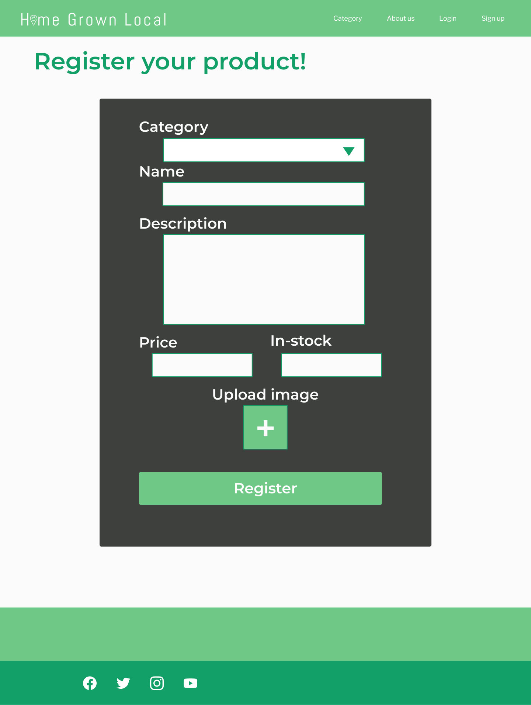
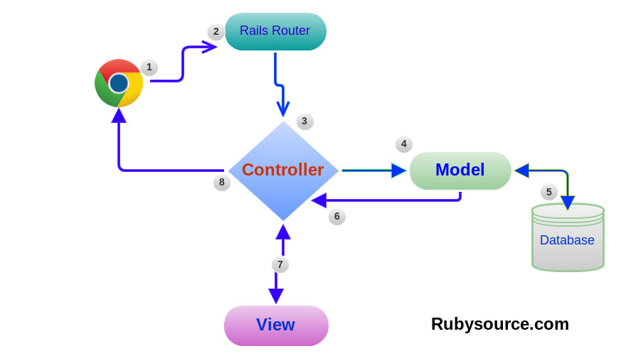

# Homegrown Local

[GithHub Repo]()\
[View Live Application](/)

---
## Contents

**[=> Section 1: Description](#Section-1:-Project Detail)**

**[About](#About Us)**\
**[Tech Stack](#Tech-Stack)**\
**[Configuration](#Configuration-/-Installation-Instructions)**\
**[Sitemap](#Sitemap)**\
**[Features](#Features)**\
**[Screenshots](#Screenshots)**\
**[Our Inspiration & The Idea](#Inspiration-/-Original-Idea)**

**[=> Section 2: Planning](#Section-2:-Planning)**

**[Project Plan](#Project-Plan)**\
**[Wireframes](#Wireframes)**\
**[ERD](#ERD-/-Database-Relationships)**\
**[User Journey Diagram](#User-Flow-Diagram)**\
**[Team Communication](#Communication)**\
**[Task Management](#Task-Management)**\
**[Version / Source-Control](#Version-/-Source-Control)**

**[=> Section 3: Short Answer Questions](#Section-3:-Short-Answer-Questions)**

**[=> Section 4: Reflection](#Section-4:-Reflection)**

**[Challenges](#Challenges)**\
**[Take-Aways](#Take-Aways)**\

**[=> Section 4: Section 5: Appendix](#Section-5:-Appendix)**

**[Search & Filtering](#Search-&-Filtering)**

## __Section 1: Description__

### __About Us

### __Tech Stack__    
- Front-end: HTML, ERB, CSS, Sass, Javascript
- Back-end: Ruby, Ruby on Rails
- Database: PostgreSQL Database with ActiveRecord
- Deployment: Heroku

### __Configuration / Installation Instructions__

In your local directory run 'git clone https://github.com/chrisstaudinger/home-grown-local'

Open the directory you clone the repositories to, 

We are using Visual Code, so make sure you open the directory where the files been unzipped to:

code/run - 'bundle install' to install the dependencies

code/run 'rails db:reset' to reset the database (db:reset will drop the database, seed data)

code/run rails s to run the server in development mode

In your browser, navigate to 'http://localhost:3000/' to view the website

You can browse without login or create new account. Only if you want to 'Post and Item' or 'Buy Item' that you need to login/create account. We provide link to login (if you have already created account) or to create account (if you have not had an account)

### __Sitemap__

### __Features__

- Create user account and modify profile
. Secure login, authorisation and authentician.
. View items - free browsing for non registered user
- For future enhancement, user can review trees                    

### __Screenshots__

\
\
\
\

### __Inspiration / Original Idea__

---
## __Section 2: Planning__

### __Project Plan__

We brainstorm ideas and took votes on what application to create. Our discussion range from tutoring website to holiday campervan hire, but we decided to make market place application for homegrown plants and products. We are aware there is already one entirely new but aggressive new company doing a similar website. 

Then we sketched out draft wireframe:

Then we decided on our colour palette and some design details:

Drafted our user-stories: 

### __Wireframes__
 

### __ERD / Database Relationships__

### __User Journey Diagram__

### __Team Communication__

#### __Task Management__

We used Trello to manage our workflow. We have tried using colour schemes before but never found it worth the effort, so stuck with a simple Agile structure (Task List / To do, Doing, Done, and then a Bucket List / Wish List). The most important factor in this system is labelling tasks each person is doing with their initials and then moving the task to the appropriate list (doing / done) so the other person knows what's going on. 

### __Version / Source Control__

We used Git CLI, GitHub and Heroku CLI for source control/version control. After initializing a new repository, we were able to clone the repo for the other person and set up multiple contributors. 
Then we would both work on separate local branches before pushing commits to the origin branch. We make sure that every commit is only to local branch. Every day we would request pull from origin to merge with local branch. One programmer will review the merge conflicts and decides on versions to merge. Once changes confirmed, push commit to the local master and use that as the start of new production for that day. 

>>>>>>>>>>>>>>>>>>>>>>>>>>>>>>
---
## __Section 3: Short Answer Questions__

### 1
What is the need (i.e. challenge) that you will be addressing in your project?

@HOMEGROWN-LOCAL promotes diversity, quality and uniqueness. We are giving consumer ability to choose to have their fruits and vegetable demand being met by their local growers. The supply hopefully will bring back the quality of our fruits and vegetable supplies because products are being harvested while ripe and time travel to consumer plate is reduced being local. Unlike fruits from a commercial food distributor, our fruits and vegetable will focus on quality not looks, apples might not look perfect but they taste good and super fresh. @HOMEGROWN-LOCAL will also be bringing the profits back to the grower by cut short the distribution chain. 

### 2) Identify the problem you’re trying to solve by building this particular marketplace App? Why is it a problem that needs solving?

Homegrown Local promotes home industries with a bonus of providing variety and healthier options for consumers. Our retail food chain harvests fruits and vegetables while firm because products need to stay edible months until they reach consumers. Homegrown Local home industry will supply fruits and vegetables that taste the best as they are ripe on the tree. 
Homegrown local will also try to promote edible urban landscape. Users are encouraged to share tips and interests on urban farming and sharing their produce 24/7 without needing to wait for Sunday market. 
The demand of organic food is increasing throughout the years. Home industry fruits and vegetables are naturally organic. Hence consumers can have access to organic fruits vegetables at a fraction of retail price. 

### 3) Describe the project will you be conducting and how your App will address the needs.

HomeGrownLocal is an web application that directly connects farmer with consumer. Our application also happens to be a two sided marketplace, therefore the consumer are allowed to participate as a seller if the consumer happened to have a small garden or a vacant field.

### 4) Describe the network infrastructure the App may be based on.

Our app is deployed through the following process:

__APPLICATION DEVELOPMENT PHASE__

Ruby on Rails is a popular web framework written in Ruby.
Codes are written using Ruby on Rails application and deployment for local testing enabled using with inbuilt Rails Server hosting it at a localhost port). For Version Control we manage our source code using Github repositories. Each programmer needs to download a version from origin each time before starting daily coding. Pull request generated and merge with a local master. 
Our database is using PostgreSQL.

__APPLICATION DEPLOYMENT / EXECUTION PHASE__

Heroku integrates with GitHub to make it easy to deploy code living on GitHub to apps running on Heroku. When GitHub integration is configured for a Heroku app, Heroku can automatically build and release (if the build is successful) pushes to the specified GitHub repo.

We integrate our Github repositories with Heroku application deployment (To configure GitHub integration, you have to authenticate with GitHub. You only have to do this once per Heroku account). We use the Heroku dashboard to configure Github integration.

Heroku is is a free Cloud-based platform to build and deploy internet application. 
Deployment is performed directly from GitHub via Heroku's deployment platform. Heroku can be accessed either directly from GitHub or through the Heroku Command Line Interface (CLI). 

The Heroku Command Line Interface (CLI) makes it easy to create and manage your Heroku apps directly from the terminal

### 5) Identify and describe the software to be used in your App.

Software Languages:

Front-end:
HTML: HyperText Markup Language. A language used to constract web pages. Used mostly for structure, capable of basic styling for elements.
ERB: Embedded Ruby. ERB enables ruby logic to be implemented directly in an HTML page and read by the browser as HTML. 
CSS: Cascading Style Sheets. CSS sheets are attached to an HTML page to style the web-page. Mostly styles are static elements, though can be used to create minimal animations.
Sass: Syntactically Awesome Style Sheets. Adds some additional features to CSS while also able to be written as standard CSS. Additional features include, variables, nested elements (for cleaner organisation and grouping of elements), mixins (methods)

Back-end:
Ruby: 
Ruby on Rails: Web application framework written in Ruby. Used to create full-stack web applications. MVC (Model Controller View) framework using separation of concerns. Emphasises CoC 'Convention Over Configuration', in other words is meant to be able to be used out of the box with conventions specific to RoR, and a large degree of abstraction to automate many technical or time-consuming aspects of building a web application, like spawning databases and writing database migrations, creating controllers, views, routes, and handling different types of HTTP requests.

Database Software:

PostgreSQL Database: A popular Relational Database Management System based on the SQL Database Language. Data is strutured in a way that allows for queries based on data objects and their relationships with each other, written natively or through an ORM.
ActiveRecord: An ORM 'Object Relational Mapping' tool. Abstracts SQL query language so that code can be written in another language like Ruby, and used to speak to the database and request information.
Rake: Software Task Management and Build Automation tool written in Ruby. Can be used to define various tasks used in configuring software build, file compilation, database creation and management.

Version Control:

Git and GitHub: Source Control software. Open-sourced popular software development tool that allows for either single programmerse to work on their local machine, or remote teams to work together on a project using the GitHub Web Application connected to a local CLI Command Line Interface. Most popular features are the ability to 'commit', or save a piece of software at a certain 'state', which can be returned to at a later date. Also allows asynchronous development of applications and features using 'branches' of software that are written concorrently but don't affect the core branch unless merged at a later time.

Deployment:

Heroku

### 6) Identify the database to be used in your App and provide a justification for your choice.

We used PostgreSQL for our application, for a few different reasons:
- We wanted to use an SQL-language database. SQL databases arethe most popular by far which means they have significant documentation available on the internet and should be easy to troubleshoot.
- PostgreSQL is a relational database, making it easy to manipulate and access data. 
- PostgreSQL works very smoothly when building an app with Ruby on Rails, and deploying to Heroku.

### 7) Identify and describe the production database setup (i.e. postgres instance).

> rails new -d postgresql
It will create a local instance of PostgreSQL database using Ruby on Rails using Ruby on Rails. 

> rails db:create
It will create our database for the current RAILS_ENV environment, by default it is both the development and test databases.

> rails g scaffold (Model) or rails g model (Model)
It will create schema for our tables

> rails db migrate 
It will create relevant tables from our schema

This postgresSQL database will become our Development and Testing database 

>rails db:seed
It will seed our database with fake data we put on seeds.rb file

For Production, the Migrations and Schema of our Development Database are pushed to Heroku from the GitHub repository, then set up within Heroku. To do this we run:

> heroku db:create
> heroku db:migration 

Because the schema and migrations are the same, the structure of our database on Heroku is exactly the same and can be seeded using the same seeds.rb file. We create an instance of our postgres database in Heroku (Heroku host the database)

### 8) Describe the architecture of your App.

__Application Architecture Diagram__
 

#### __Ruby on Rails Architecture (ROR) __

Components:
Model
Ruby on Rails Server (instantiates BROWSER)
Routes (Rails Router)
Controllers and their Actions 
Views
Assets (Database)

Model 
They offer methods to transfer the memory-resident state of a model instance into the database. For example: order.save would save an Order representation into the corresponding database table. Model is not a web page but we can do lot of action with rails console.

Ruby on Rails Server
It accepts request from the browser. It listens to an IP or a Port. While we code, rails server listen on request from port 3000 so we can access it via http://0.0.0.0:3000/. Rails server also writes logs and write it into log folder

Routes
The Routes gives access to the views of our model and web application by designing certain routes views
The rotes are configured inside config/routes.rb
so get '/login', to: "sessions#new"
The above route entry tells Rails that, when an HTTP GET request is coming in for the path /login (e.g. the user types in the address http://0.0.0.0:3000/login on their browser address bar, in order to visit the particular page), then this request should be handled by the sessions controller action new.
Most common HTTP requests are:
GET (request information from the database)
DELETE (delete information in the database)
POST (send new information to the database)
PATCH / UPDATE (update / change existing information in the database)

Controllers and their actions
Each controller is basically a Ruby class and its actions are public methods. Hence, for the route that we saw above, on which we involved sessions controller, the controller is going to be a class with name SessionsController. Also, its action new is going to be a public method of that class. Something like this:

class SessionsController < ApplicationController
  # ... possibly more actions here ...
  
  def new
    # ... handle the request ...
  end
  
  # ... possibly more actions here ...
end

Requests from browser will be translated into one function in controller. Functions either:
Query information from the database
Request to load certain view web page. 

Views
Views will tell Rails which content of HTML will be sent back to browser having issued the request. Views rely on data that been sent back by controller and layout. 

The following image shows clearly these components in Rails folder

Assets

These assets usually, JavaScript code, CSS code and other media such as images, usually being sent over to alongside the view content.

### 9) Explain the different high-level components (abstractions) in your App.

Component is the name given to a Ruby on Rails engine or Ruby gem when used as building block of the Rails application. 

The high level components are required by the main Rails application Gemfile. A component dependencies are set in its .gemspec file, a test suite will test it in isolation and ensure the dependency structure is solid.

High level components in our App:
Devise - User
Devise - User has its own views, controller, models, migrations and tests live within the component

### 10) Detail any third party services that your App will use.

Services:
- S3 Module: Image Storage from Amazon Web Services
- Stripe: Payment processing Software as a Service (SASS) from Stripe. Allows users to pay for products or services within the app using credit card. 
- > Suki    ..Creates and sends email from a specified account to registered users, triggered by certain actions defined within the application.
AWS / Active Storage: Used to host uploaded images on Amazon Web Services

__Key Gems / Modules:__

- Devise: User Authentication module used to manage user registration, sign-in, passwords, confirmation etc
- Pundit: Authorizations module used to define the scope of authority for that particular class of users, the scope defined in policy description. 
- Elastic Search - autocomplete for users search on indexed category
- Google Autocomplete Place API - API using built in Google Place API to autocomplete users key stroke for suburbs or location

__Full List of Dependencies:__

ruby '2.5.1'\
gem 'rails', '~> 5.2.3'\
gem 'pg', '>= 0.18', '< 2.0'\
gem 'puma', '~> 3.11'\
gem 'sass-rails', '~> 5.0'\
gem 'uglifier', '>= 1.3.0'\
gem 'coffee-rails', '~> 4.2'\
gem 'turbolinks', '~> 5'\
gem 'jbuilder', '~> 2.5'\
gem 'bootsnap', '>= 1.1.0', require: false
gem 'tzinfo-data', platforms: [:mingw, :mswin, :x64_mingw, :jruby]\
gem "devise", "~> 4.6"\
gem "cancan", "~> 1.6"\
gem "cancancan", "~> 3.0"\
gem "stripe", "~> 4.16"\
gem "dotenv-rails", "~> 2.7"\
gem "faker", "~> 1.9"\
gem "pry", "~> 0.12.2"\
gem "aws-sdk-s3", require: false\
gem 'bootstrap', '~> 4.3.1'\
gem 'jquery-rails'\
gem "font-awesome-rails"

group :development, :test do\
  gem 'byebug', platforms: [:mri, :mingw, :x64_mingw]\
end

group :development do\
  gem 'web-console', '>= 3.3.0'\
  gem 'listen', '>= 3.0.5', '< 3.2'\
  gem 'spring'\
  gem 'spring-watcher-listen', '~> 2.0.0'\
end

group :test do\
  gem 'capybara', '>= 2.15'\
  gem 'selenium-webdriver'\
  gem 'chromedriver-helper'\
end

### 11) Describe (in general terms) the data structure of marketplace apps that are similar to your own (e.g. eBay, Airbnb).

https:/http://www.backyarddirect.com.au/
The website post 'undergone maintenance' They were active with posts and reviews but their website now idle.

https:/https://www.ripenear.me/
The website is providing free service for user to register and post their tree on the map. Trees then have fruits/produce and users can  'ripe' or 'not ripe'. Their app heavily reliant on Google Map to facilitate the mapping of trees. Users registration profile can be automatically linked through Omniauto with third party profile such as Google, Facebook, Twitter and Email. There is no online payment system for products and there is no donation button. However they linked with crowdfunding website to raise fund to further develop and hosted their large database mapping system.They have raised $25,000 so far. 
Users can post review and comments to the items. Their database looks very large as each item will have not only review but also comment plus friends plus subscriptions. 

### 12) Discuss the database relations to be implemented.

We used a range of database relations. 
Users have a single profile, many reviews, many bookings and many orders. Therefore to describe the other side of those relationships, profiles, reviews, bookings, and orders all belong_to user. For the Users > Bookings and Users > Orders relationships, both are defined by a single additional instance, a User_Booking or a User_Order, therefore we used has_and_belongs_to_many. 

### 13) Describe your project’s models in terms of the relationships (active record associations) they have with each other.

We used the following active record associations:

City 
  belongs_to :state
  has_many :locations

 ItemCategory 
    has_many :items

 ItemReview
  belongs_to :item
  belongs_to :reviewer, :class_name => 'User'

Item
  belongs_to :item_category
  belongs_to :user
  belongs_to :measurement
  has_many :watchitems
  has_many :watchlists, :through => :watchitems
  has_many :requests
  has_many :orders, :through => :requests
  has_many :item_reviews

  has_one_attached :image

Location 
  belongs_to :city

Measurement 
    has_many :items

Order 
  belongs_to :user
  has_many :requests
  has_many :items, :through => :requests

Profile 
  has_one :user

Request 
  belongs_to :item
  belongs_to :order

Role 
  has_many :users

State 
    has_many :cities

UserRating 
  belongs_to :reviewee, :class_name => 'User'
  belongs_to :reviewer, :class_name => 'User'

User 

  belongs_to :location, optional: :true
        
  has_many :received_user_ratings, :class_name => 'UserRating', :foreign_key => 'reviewee_id'
  has_many :sent_user_ratings, :class_name => 'UserRating', :foreign_key => 'reviewer_id'

  belongs_to :profile
  has_one :watchlist
  has_many :items
  has_many :orders
  belongs_to :role

  has_many :sent_item_reviews, :class_name => 'ItemReview', :foreign_key => 'reviewer_id'

WatchItem
  belongs_to :item
  belongs_to :watchlist

Watchlist 
  belongs_to :user
  has_many :watchitems
  has_many :items, :through => :watchitems
### 14) Provide your database schema design.

[Database Schema](./docs/database_schema.png)

### 15) Provide User stories for your App.

__USER STORIES__

As a guest user - a user who is not signed in, I should be able to:
1.  View the homepage, browse through the list of organic produce within my area, or if no suitable results, to search products at other geographical areas.
2.  Navigate through the front page to find out price and quantity of the products on the list
3. Navigate through the front page to search of a particular item
4. Click on a particular listing to view further about the produce 
(description, and exact address)
5. Communicate directly with the seller through the form and/or view seller contact number 
6. Go back to homepage from any other pages on the website 
navigate through the website to find out whether produce can be delivered
4. find out payment methods
5. search products with high ratings or read comments from other users 
 

As a signed in user, I should be able to:
 
1. create a new account
2. login and create new listing
3. login and update listing (quantity or price)
4. login and check and reply to messages
5. login and check total orders to date 
6. login and search particular order (to get detail of purchaser, quantity, or address of buyer in case drop off order)
7. login and search related produce within the area
8. view ratings or reviews
 
administrator wants to be able to:
1. view all users profiles and orders
2. view complaints or messages
3. build KPIs - total order by number per week, total order by quantity per week, or per month, total new users per month
4. moderate content (reviews/profiles)
a. flag users/content>notify admin
b. softban (1 day)
5. edit/delete content, including orders and listings
6. view financial data

>>high fidelity User Interface Flow - 
single task flows Task Flows
 
 
Wire flow - component level
1. home page
2. index
3. show page
4. account set up page
5. index page
6. show page
7. 
10. index page
 
User flow - interaction level

### 16) Provide Wireframes for your App.

[View at Figma.com]
Here are a few screenshots of Wireframes for our App : 
1) 
2) 
Based on the design of our site map, with FIGMA, we designed set of  mockup pages for our application. These set of mockup pages how the design architecture for all the html.erb files. then through Trello cards, we assign each page or functionality to a team member.  

Then we started out by sketching the structure of our app. Link to our sketches are down below :

We've also created to different views (logged in versus logged out view), to outline how the structure of our page would appear in different circumstances. 

1) The first one is the homepage, which consists of a description of our website/app, it navigates user to the login && sign up page, as well as the search page. 

2) Next is the search page,( index.html.erb of PROFILE model) which is comprised of a list of tutor profiles which allows users(aka students) to look for a suitable tutor. 

3) We also planned all the structure and how the CRUD elements are supposed to fit together in different pages (
  create a new profile page, show your profile page, edit own profile page.)

4) We also planned the core structures for all other models (Booking, Review..etc), as well as the sign up and log in page.

### 17) Describe the way tasks are allocated and tracked in your project.

- Both tasks allocation and tracking are achieved through Kanban board, there are few layers of stages in our Kanban board.

  Trello has played an important role in allocating and tracking our tasks throughout the rails project.

  We separated our work into different categories (Trello cards) : v1 - v2 - v3, which is version 1 (MVP) and v-2 & v3 (future enhancements), and each card is assigned to a member at the beginning of each day. 
  Each card has due date, so we can stay on top of our deadlines and tasks. At the end of each day, we look again to the Trello cards and check with the day progress of each team member. 
  
  We prioritise our essential tasks first, all V1 - MVP - cards, before assigning any V2 or V3. 
  
  Design is implemented in the beginning using Figma to create sets of mockups pages based on site map and user flow diagram. 
  
  The team agreed on the overall design, the tone, and color scheme and fonts for the website. Whilst one of the team member did mockups, the other two team member started to get the production sytem ready. ERD tables are discussed and designed and agreed to, then moved to generating the tables in code. and then seeding the data. 

  We started to plan our coding environment by installing required gems and getting our Stripe payment system ready to be integrated in our code. 

  Devise for user authentician implemented and views generated. 
  Pundit for user authorisation implemented. 

  We ended up using Google Map API for the drop down box for area search for our products search. 
  
  What we've done were also to discuss the priority for each day in the morning, and then constantly check our trello to ensure that we are on track, as well as to remove any nonessential tasks. Nevertheless, we also tend to break up bigger tasks into smaller ones in order for us to manage our tasks more efficiently. 
  
  On top of that, one of team member making sure that Trello cards are updated with new progress or additional tasks needed to be done. 
  
  We have to review the charge system of our website considering the durability of our fresh products. We decided to remove the Buy button and implemented donation system. Donate button on the navigation page. 

### 18) Discuss how Agile methodology is being implemented in your project.
  
- We conducted a daily stand-up meeting on daily basis to promote open communication between team members.

- We initially prioritize on our MVP (Minimum Viable Product) rather than having sophisticated unfinished product.

- We constantly communicate with our instructor to ensure that our product doesn't get sidetracked and properly fulfilled our requirements.

- We are using Kanban board via Trello. Tasks assignment and re-prioritization is achievable because of this tool.

### 19) Provide an overview and description of your Source control process.

We used Git CLI, GitHub and Heroku CLI for source control/version control. After initializing a new repository, we were able to clone the repo for the other person and set up multiple contributors. 
Then we would both work on separate local branches before pushing commits to the origin branch. We make sure that every commit is only to local branch. Every day we would request pull from origin to merge with local branch. One programmer will review the merge conflicts and decides on versions to merge. Once changes confirmed, push commit to the local master and use that as the start of new production for that day. 
  
### 20) Provide an overview and description of your Testing process.

We test the application manually on each routes once data were seeded. We generated views of all items and show each item detail and try to create new product. 

We test Devise - authentication - by manually trying to create new item when not logged in. 

We test our user flows based on whether he/she is a guest and then another set of tests whether he/she is a signed in user.Our policy is users can move around freely without logged in such as  browse and see index page and show page and do searches for products based on category or based on post code until such time he/she decides to purchase then new user login page will appear. 
A signed in user can be both or either or neither buyer/seller. A signed in user can edit his/her profile. 

We test our database entry or update methods by a user create new profile or update his/her profile and whether the database actually modified. 

We test Pundit - authorisation - manually by creating scenarios such us a user should not be able to review his own item, or a user should not be able to create his own rating. 

We test the search process by category and another set of tests by postcode/suburb. On this version, we can not implement further geographical search list which means if a user select an area, the search should be able to show items within the close proximity. 

We test the Donate button against Stripe. 

We test our mobile viewing by open our Heroku site at a mobile browser 

WE also test our application to be opened in Chrome, Firefox and Safari and Internet Explorer)

### 21) Discuss and analyse requirements related to information system security.

Privacy Act 1988
As we collect personal information, we need to create and make available APP Privacy Policy. 

Because they handle sensitive and personal information, e-commerce application have particular security concerns. ...
Database server: The safeguarding of site data and user confidential information to protect it from being accessed by unauthorized user. A hacker should not be able to systematically going to the database to view, steal or update database.

We as administrator of the website would be able to have access to all users personal information. So procedures should be put in place as to how this administrator would use and handle his access, ie automatic logout, login password kept in safe place and not to be shared with anyone. 
 
 Pundit is providing protection to information collected by knowing which user currently logged in and which information he/she has access to. 

### 22) Discuss methods you will use to protect information and data.
In overall data protection policy should be in place and reviewed on yearly basis as the organisation grows bigger and available technology changes. 

Database server is protected by a password that only administrator has access to, so safeguard and proper encryption for administrator password should be included in the policy. 

Users password encryption should also be in the policty. 

Malware or antivirus software protection to prevent disaster in data by hackers or virus should be in policy and reviewed regularly. 

We should test that Pundit is working solidly to protect access to areas that a particular user not meant to go to. 

 ## 23) Research what your legal obligations are in relation to handling user data.Privacy Act 1988

As we collect personal information, our legal obligations are both to disclose the following: 

- WHAT information we collecting and hold 
- HOW we collect and hold it and how to protect the data against hackers or potential breach of security
- WHY we collect, hold, use and disclose that personal information
- most importantly, whether you disclose that personal information to overseas entities. 
- and how we going to use the Privacy information for the company activities, need to outline them such as providing services, or conducting publicity campaigns, or handling user complaints, or managing user records or sending out newsletters.
In our application, we need to make it available for users to review our Privacy Act Policy.

Given we are collecting personal information, we need to make sure that within the app, functionality tested for authorisation and authentication, to make sure there is no breach of privacy. 

In a production environment, backup system and security system should be in place to make sure there is a limited risk of data breach or data loss due to system failure. 

## __Section 4: Reflection__

We underestimate the complexity of completing MVP with obstacles along the way, but we insisted on having cool functionalities which are critical for users such as elastic search and Google Autocomplete API. 

We initially have implemented payment system for each product (users can pay online for a product), but we realise the limitation of our products being perishable so we decided it would be best for buyers and sellers to meet and pay cash on hand. 

### __Challenges__

This projects threw up more than design or coding challenge but more towards teamwork and how best to utilize individual main strength or skill sets while distributing tasks fairly and evenly. 

Part of the biggest challenge is to get used to using Git collaboration for three team members and distributing tasks, so each team member participated in all aspects of the project.  By the time two weeks passed, we barely completed version 2, we underestimated complexity in teamwork and making sure we following Agile methodology. 
We have managed to follow Agile design methodology until the end. 

### __Take Aways__

We should have analysed our competitor website more closely and identified their challenges and provide ours as a solution to those issues. 
It also will help us to understand better our target market.  We were going to implement a payment system as our competitor website does not use one. Upon analysing the constraints and various factors, it is much more sense to have cash on hand payment system. 

--- 
## __Section 5: Appendix__

### Version 2 - future enhancements__
Admin dashboard
Adding fields/token to items 'about to expire Y/N' - Urgent Sale item
Search functionality to return items located in neighbouring suburbs
Subscription model feature
Google Analytics Integration
Devise to return to user confirmation emails

### Search & Filtering__

#### API used
Google Autocomplete Place API:
https://developers.google.com/places/web-service/autocomplete
The Place Autocomplete service is part of the Places API and shares an API key and quotas with the Places API. The Place Autocomplete service is a web service that returns place predictions in response to an HTTP request. 

In our homepage, user can type words to reflect their search area (home) and the text box will response to knowns postcode. 

Elastic Search: http://www.elasticsearch.org/
Elasticsearch is used as an open-source, RESTful, distributed search and analytics engine built on Apache Lucene. 

In our homepage, user can type words related to category of products to be searched and the text box will return available products within that searched 'keywords'

